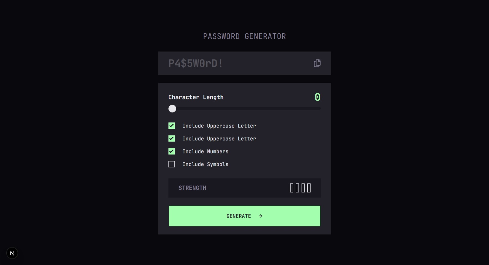

# Frontend Mentor - Password generator app solution

This is a solution to the [Password generator app challenge on Frontend Mentor](https://www.frontendmentor.io/challenges/password-generator-app-Mr8CLycqjh). Frontend Mentor challenges help you improve your coding skills by building realistic projects.

## Table of contents

- [Overview](#overview)
  - [The challenge](#the-challenge)
  - [Screenshot](#screenshot)
  - [Links](#links)
- [My process](#my-process)
  - [Built with](#built-with)
  - [What I learned](#what-i-learned)
  - [Continued development](#continued-development)
- [Author](#author)

## Overview

### The challenge

Users should be able to:

- Generate a password based on the selected inclusion options
- Copy the generated password to the computer's clipboard
- See a strength rating for their generated password
- View the optimal layout for the interface depending on their device's screen size
- See hover and focus states for all interactive elements on the page

### Screenshot



### Links

- Solution URL: [Github](https://github.com/AutumnsCode/fem_passwordgenerator)
- Live Site URL: [Live Site](https://fem-passwordgenerator.vercel.app/)

## My process

### Built with

- Mobile-first workflow
- [React](https://reactjs.org/) - JS library
- [Next.js](https://nextjs.org/) - React framework (App Router)
- [TypeScript](https://www.typescriptlang.org/) - For type safety
- [Tailwind CSS](https://tailwindcss.com/) - For styles

### What I learned

The part I'm most proud of is the `usePasswordGenerator` custom hook, which encapsulates all password generation logic and state in one place. Instead of scattering that complexity across the component, the hook owns everything: the selected options, the length, the generated password, the strength level, and the error state. The page component stays clean and just calls the hook.

The generation logic has a few non-obvious pieces I had to think through carefully:

**Guaranteeing every selected group appears at least once.** A naive implementation just picks random characters from the combined pool, which can produce a password with no uppercase letters even if that option is checked. My solution picks one random character from each selected group first, then fills the remaining slots from the full pool, and finally shuffles the whole array so the guaranteed characters don't cluster at the front:

```ts
const guranteedCharacter = enabledOptions.map(([key]) => {
  const chars = CHARS[key as OptionKey]
  return getRandomChar(chars)
})

const restCharacter = Array.from(
  { length: length - guranteedCharacter.length },
  () => getRandomChar(allCharacter)
)

const newPassword = shuffleCharacter([...guranteedCharacter, ...restCharacter]).join("")
```

**Entropy-based strength calculation.** Strength is calculated as `bits = length × log2(charsetSize)`. The more character groups are active and the longer the password, the higher the entropy. Fixed thresholds map those bits to the four strength levels shown in the UI.

**Error messages — not part of the original design, but something I added myself.** The challenge spec doesn't mention input validation, but without it the app can silently produce broken output. I added three specific error cases:

- Length is 0 → `"The Password must be at least 1 character long."`
- No character group is selected → `"Please select one options above"`
- Length is shorter than the number of selected groups (the guarantee-every-group logic would be impossible) → a contextual message: `"Your password must be at least X characters long because you selected X character groups."`

The errors are always present in the DOM but toggled with `opacity-0` / `opacity-100`, so the layout never shifts when they appear or disappear:

```tsx
<p className={`text-sm text-red-500 transition-opacity duration-300 ${errorMsg ? "opacity-100" : "opacity-0"}`}>
  {errorMsg}
</p>
```

### Continued development

I want to keep practising the pattern of isolating logic into custom hooks — `usePasswordGenerator` made the page component much easier to read and I want to apply this more consistently. I'm also interested in exploring `crypto.getRandomValues` as a more cryptographically sound replacement for `Math.random()` in security-sensitive tools like this one.

## Author

- Frontend Mentor - [@yourusername](https://www.frontendmentor.io/profile/AutumnsCode)
